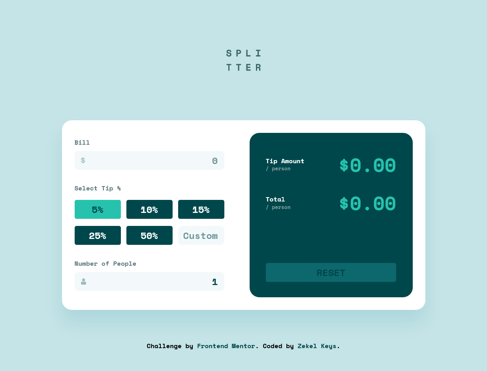

# Frontend Mentor - Tip calculator app solution

This is a solution to the [Tip calculator app challenge on Frontend Mentor](https://www.frontendmentor.io/challenges/tip-calculator-app-ugJNGbJUX). Frontend Mentor challenges help you improve your coding skills by building realistic projects.

## Table of contents

- [Overview](#overview)
  - [The challenge](#the-challenge)
  - [Screenshot](#screenshot)
  - [Links](#links)
- [My process](#my-process)
  - [Built with](#built-with)
  - [What I learned](#what-i-learned)
  - [Continued development](#continued-development)
  - [Useful resources](#useful-resources)
- [Author](#author)

**Note: Delete this note and update the table of contents based on what sections you keep.**

## Overview

### The challenge

Users should be able to:

- View the optimal layout for the app depending on their device's screen size
- See hover states for all interactive elements on the page
- Calculate the correct tip and total cost of the bill per person

### Screenshot

### Links

- Solution URL: [github repo](https://github.com/ZZ83/tip-calculator-app)
- Live Site URL: [Live Website](https://zz83.github.io/tip-calculator-app/)

## My process

### Built with

- HTML 
- CSS
- Flexbox
- Mobile-first workflow
- Vanilla JavaScript

### What I learned

I learned a little bit more about working with regular expression.

### Continued development

I would like to start commenting my code more and start writing cleaner code in HTML, CSS, and JavaScript.

### Useful resources

- [Resource 1](https://codepen.io/hsucherng/pen/MzrxMM?editors=0010) - This helped me figure out how to allow only certain characters into an input.

## Author

- Dev - [ZZ83](https://dev.to/zz83)
- Frontend Mentor - [ZZ83](https://www.frontendmentor.io/profile/ZZ83)
